# ラボ 00：環境設定 — Zava Corporation のAIエージェントインフラストラクチャ

## はじめに

**Zava Corporation**は、英国およびEU全域で事業を展開する中規模の金融サービスおよび人事コンサルティング企業です。Zavaは、機密性の高い従業員記録、顧客の財務データ、およびサードパーティベンダーとの契約を管理しています。同社では最近、業務効率の向上を目的として、人事、財務、ITサポートの各部門にAIエージェントを導入しました。

セキュリティ設定を開始する前に、Zava Corporation の環境を完全にプロビジョニングする必要があります。この実習では、Microsoft Entra ID テナントの設定、Microsoft Copilot Studio の有効化、エージェント作成に必要なセキュリティグループの登録、コース全体を通じてガバナンスの対象となる 3 つの AI エージェントの作成、各エージェントを指定された SharePoint ナレッジソースへの接続、および Zava の実データ環境をシミュレートするサンプルビジネス文書のアップロードを行います。

以降のすべての実習は、ここで作成されたエージェント、ID、およびファイルに依存します。ラボ 01に進む前に、3つの演習をすべて順番に完了させてください。

---

   > **注:** 実際の環境では、このような責任は、開発者、IT管理者、セキュリティ管理者、コンプライアンス担当者といった複数の役割に分散され、各役割は「最小権限の原則」および「ゼロトラスト」の原則に沿った範囲限定の権限で運用されます。

---

## 目的

- Microsoft Entra ID でロール割り当て可能なセキュリティ グループを作成し、そのグループに「特権ロール管理者」ロールを割り当てます。
- Power Platform 管理センターで、**copilotagentsecurity** グループを Copilot Studio の承認済み作成者グループとして有効にします。
- 環境レベルで、Copilot Studio の Entra エージェント ID を有効にします。
- Power Apps メーカー ポータルで、SharePoint をデータ ソースとして接続します。
- 3 つの Copilot Studio エージェント（Zava HR アシスタント、Zava 財務エージェント、Zava IT サポートエージェント）を作成します。
- 各エージェントを、指定された SharePoint ナレッジソースに接続します。
- 各エージェントを公開し、該当するラボユーザーと共有します。
- Zava のサンプル ビジネス ドキュメントを、人事および財務の SharePoint サイトにアップロードします。
- Microsoft Agent 365 エージェント レジストリで、3 つのエージェントすべてが「アクティブ」と表示されていることを確認します。

---

## ラボ所要時間

推定所要時間：**30分**

---
## 演習 0: Zava HR SharePoint サイトを作成する

1. 新しいブラウザタブを開き、以下のサイト `https://admin.microsoft.com` に移動します。プロンプトが表示された場合は、**ODL_User** の認証情報でサインインしてください。

	- **メールアドレス/ユーザー名:** <inject key="AzureAdUserEmail"></inject>
	- **パスワード:** <inject key="AzureAdUserPassword"></inject>

2. 左側のナビゲーションペインで **[すべてを表示]** をクリックし、**[管理センター]** の下から **[SharePoint]** を選択します。

	

3. SharePoint 管理センターで、左側のナビゲーション ペインから **[サイト (1)]** を展開し、**[アクティブなサイト (2)]** を選択します。その後、**[+ 作成 (3)]** をクリックします。

	

4. **[サイトの作成]** パネルで、**[チームサイト]** を選択します。

	

5. **[テンプレートの選択]** ページで、**[標準チーム]** を選択します。

	

6. **['標準チーム' テンプレートのプレビューと使用]** ページで、**[テンプレートを使用]** を選択します。

	

7. **[チームサイト]** 構成ページで、以下を入力して **[次へ(4)]** をクリックします。

   - **サイト名 (1):** **HR<inject key="Deployment ID" enableCopy="false"></inject>**
   - **サイトアドレス (2):** URL パスが **/sites/HR<inject key="Deployment ID" enableCopy="false"></inject>** であることを確認します
   - **グループの所有者 (3):** ODL_User <inject key="Deployment ID" enableCopy="false"></inject>

	

8. 以下の詳細情報を追加して、**[サイトを作成 (4)]** をクリックします。

   - **プライバシー設定 (1):** **[プライベート - メンバーのみがこのサイトにアクセスできます]** を選択します。
   - **言語を選択 (2):** 日本語
   - **タイムゾーンを選択 (3):** (UTC+09:00) 大阪、札幌、東京

		

9. **[サイト所有者とメンバーの追加]** ページで、**[完了]** をクリックします。

	

10. サイトのプロビジョニングが完了するまで待機します。**[アクティブなサイト]** リストに URL **https://[TenantPrefix].sharepoint.com/sites/HR<inject key="Deployment ID" enableCopy="false"></inject>** が表示されていることを確認します。

   > **注：** このサイトは、ラボ 00の演習 2 で作成した Zava HR アシスタント エージェント用の SharePoint ナレッジソースです。Copilot Studio でのエージェント接続では、**/sites/HR<inject key="Deployment ID" enableCopy="false"></inject>** が明示的に参照されます。これとは異なる URL スラッグは使用しません。

11. 手順 3 から手順 9 までの同じ手順に従い、次のサイトを作成します。

   - **サイト名:** **Operations<inject key="Deployment ID" enableCopy="false"></inject>**
   - **サイトアドレス:** URL パスが **/sites/Operations<inject key="Deployment ID" enableCopy="false"></inject>** であることを確認します
   - **グループ所有者:** ODL_User <inject key="Deployment ID" enableCopy="false"></inject>
   - **プライバシー設定:** **[プライベート]** を選択します
   - **言語を選択:** 日本語
   - **タイムゾーン:** (UTC+09:00) 大阪、札幌、東京
---

## 演習 1: Entra ID の構成と Copilot Studio 作成者の有効化

### タスク 1: サインインと多要素認証の設定

1. ブラウザを開き、`https://entra.microsoft.com` にアクセスします。

2. サインインページで、プロンプトが表示されたら、ラボ環境の **[環境]** タブに記載されている **ODL ユーザー** の認証情報を入力します:
	- **メールアドレス/ユーザー名:** <inject key="AzureAdUserEmail"></inject>

      

    - **一時アクセスパス:** <inject key="AzureAdUserPassword"></inject>

      

3. **[サインインの状態を維持しますか？]** と尋ねられた場合は、**[はい]** を選択します。

    

4. Microsoft Entra 管理センターのウェルカム画面で、**開始**を選択します。

---

### タスク 2: copilotagentsecurity セキュリティ グループを作成する

1. Microsoft Entra 管理センターの左側のナビゲーション ペインで、**[Entra ID]** を展開し、**[グループ]** を選択します。

    

2. **[概要]** ページで、**[新しいグループ]** を選択します。

	

3. **[新しいグループ]** ページで、以下のフィールドを設定します。

   - **グループの種類:** **セキュリティ** を選択します。
   - **グループ名:** `copilotagentsecurity` を入力します。
   - **グループに Microsoft Entra ロールを割り当てることができる:** **はい** を選択します。このオプションが表示されない場合は、このフィールドをスキップして次に進みます。

        

4. **[所有者]** の下で、**[所有者は選択されていません]** を選択します。

    

5. **[所有者の追加]** パネルで、**ODL_USER <inject key="Deployment ID" enableCopy="false"></inject>** を検索して選択します。[**選択**] をクリックして所有者を確認します。

    

6. **[メンバー]** の下で、**[メンバーが選択されていません]** を選択します。

    

7. **[メンバーの追加]** パネルで、**[ODL User <inject key="Deployment ID" enableCopy="false"></inject>]** および **[Patti Fernandes]** を検索して選択します。[選択] をクリックしてメンバーを確定します。

    

8. **[ロール]** の下で、**[ロールは選択されていません]** を選択します。

    

9. **[ロールの選択]** パネルで、`グローバル管理者` を検索し、**[グローバル管理者]** のロールを選択して、**[選択]** をクリックします。

    

10. **[作成]**をクリックして、新しいグループを作成します。

    

11. 確認ダイアログで、**[はい]**を選択します。

    

12. ページ上部に成功通知が表示されていることを確認します。

    

---

### タスク 3: Azure リソースのアクセス管理を有効にする

1. Microsoft Entra 管理センターの左側のナビゲーションペインで、**[Entra ID]** を展開し、**[概要]** を選択します。

    

2. **[概要]** ページで、上部のバーから **[プロパティ]** を選択します。

    

3. **[プロパティ]** ページで、**[Azureリソースのアクセス管理]** トグルを見つけて、**[はい]** に設定します。

    

5. **[セキュリティの既定値群の管理]** を選択します。

    

6. **[セキュリティの既定値群]** パネルで、**[セキュリティの既定値群]** の下にある **[有効]** を選択（まだ有効化されていない場合）してから、 **[保存]** をクリックします。

    

7. **[プロパティ]** ページに戻り、**[保存]** を選択します。

    

---

### タスク 4: 特権ロール管理者 ロールを割り当てる

1. Microsoft Entra 管理センターの左側のナビゲーションペインで、**[Entra ID]** を展開し、**[役割と管理者]** を選択します。

    

2. **[ロールと管理者]** ページの検索バーで、`特権ロール管理者` を検索し、 **[特権ロール管理者]** のロール名を選択します。

    

3. **[特権ロール管理者]** ページで、**[+ 割り当てを追加]** を選択します。

    

4. **[割り当ての追加]** パネルで、**copilotagentsecurity** を検索して選択します。**[追加]** を選択して確認します。

    

5. ロール割り当てが割り当てリストに表示されることを確認します。

    

---

### タスク 5: Power Platform 管理センターで Copilot Studio 作成者を構成する

1. ブラウザの新しいタブを開き、`https://admin.powerplatform.microsoft.com` にアクセスします。

2. 左側のナビゲーション ペインで、**[管理] (1) > [環境] (2)** を選択します。**[+新規] (3)** をクリックします。

    

3. [新しい環境] ポップアップで、名前を **DevOne-<inject key="Deployment ID" enableCopy="false"></inject>** と指定します。

    

4. 画面を下にスクロールし、[既定の設定を変更する] ドロップダウンを展開して、**[Dataverse データ ストアを追加しますか? (1)]** を有効にし、**[次へ (2)]** をクリックします。

    

5. **Dataverseの追加**ページで、[セキュリティグループ] の下にある **[+選択してください]** をクリックします。

    

6. 検索結果から **[copilotagentsecurity (1)]** グループを選択します。その後、**[完了 (2)]** を選択します。

    

7. **[保存]** を選択して設定を適用します。

    

8. **[管理]** の下にある **[テナント設定]** を選択します。**[テナント設定]** ページで、リストから **[Copilot Studio 作成者]** を見つけて選択します。

    

9. **Copilot Studio 作成者** パネルで、セキュリティ グループの下にある **[編集]** アイコンを選択します。

    

10. 検索フィールドに `copilotagentsecurity` と入力します。検索結果から **copilotagentsecurity** グループを選択します。その後、**[完了]** をクリックします。

    

11. **[保存]** を選択して設定を適用します。

    

---

### タスク 6: Copilot Studio の Entra エージェント ID を有効にする

1. 左側のナビゲーションペインで、**Copilot** を選択します。

    

2. **Copilot** ページで、**[設定]** を選択します。

    

3. 設定リストの **Copilot Studio** セクションで、**[Copilot Studio の Entra エージェント ID]** を選択します。

    

4. **[Copilot Studio の Entra エージェント ID]** パネルで、環境リストから **DevOne-<inject key="Deployment ID" enableCopy="false"></inject>** 環境を選択し、**[設定の編集]** を選択します。

    

5. [Copilot Studio の Entra エージェント ID] の設定パネルで、まだ設定されていない場合は **[オン]** を選択し、**[保存]** をクリックします。

    

1. 保存後、パネルを閉じます。

    

      >**注:** Entra エージェント ID を有効にすると、Copilot Studio エージェントに Microsoft Entra ID 内で一意の ID が自動的に割り当てられます。これは、今後のラボにおける ID ガバナンス、条件付きアクセス、および Defender for Cloud Apps との統合に必要です。
---

### タスク 7: Power Apps Maker ポータルで SharePoint 接続を追加する

1. ブラウザの新しいタブを開き、`https://make.powerapps.com` にアクセスして、プロンプトが表示される場合は、**ODL_User** の認証情報でサインインします。

	- **メールアドレス/ユーザー名:** <inject key="AzureAdUserEmail"></inject>
    - **パスワード:** <inject key="AzureAdUserPassword"></inject>

2. **[Power Apps へようこそ]** 画面が表示されたら、 **[開始する]** をクリックします。

    

3. 右上隅の環境スイッチャーで、**DevOne-<inject key="Deployment ID" enableCopy="false"></inject>** 環境が選択されていることを確認します。選択されていない場合は、環境スイッチャーをクリックし、**DevOne-<inject key="Deployment ID" enableCopy="false"></inject>** を選択します。

    

4. 左側のナビゲーション バーで、**[詳細 (1)]** を展開し、**[接続 (2)]** を選択します。

    

5. **[接続]** ページで、**[+ 新しい接続]** を選択します。

    

6. コネクタの検索バーに `SharePoint` と入力し、利用可能なコネクタのリストから **[SharePoint]** を選択します。

    

7. **[SharePoint に接続する]** のパネルで、**直接接続 (クラウドサービス)** を選択します。**[作成]** を選択します。
 
	

8. プロンプトが表示されたら、**ODL_User** の認証情報を使用してサインインし、接続を承認します。
   
    

9. [確認が必要です] というポップアップが表示されたら、[このリクエストを確認済みであり、このソースを信頼しています (1)] のチェックボックスをオンにし、[アクセスを許可 (2)] を選択します。

    

11. **[接続]** リストに SharePoint 接続が表示され、ステータスが **[接続済み]** になっていることを確認します。

    
---

## 演習 2: Zava Copilot Studio エージェントの作成

この演習では、Microsoft Copilot Studio で 3 つの Zava エージェントすべてを作成します。各エージェントには、名前、説明、操作手順、および SharePoint ナレッジソースが設定されます。公開後、各エージェントは指定されたラボユーザーアカウントと共有されます。これらのエージェントは、ラボ 01 から 07 までの実際のガバナンス対象として機能します。

---

### タスク 1: Zava HR アシスタント を作成する

1. ブラウザの新しいタブを開き、`https://copilotstudio.microsoft.com` にアクセスします。プロンプトが表示されたら、**ODL_User** の認証情報でサインインします。

    - **メールアドレス/ユーザー名:** <inject key="AzureAdUserEmail"></inject>
    - **パスワード:** <inject key="AzureAdUserPassword"></inject>

2. Copilot Studio が読み込まれない場合は、次の手順に従ってください。

    - `https://admin.powerplatform.microsoft.com/` を開きます。**[管理]** > **[環境]** > **[DevOne-<inject key="Deployment ID" enableCopy="false"></inject>]** を選択し、**[環境 ID]** の値をコピーします。
      
		
   
   - [Copilot Studio] タブに戻り、`https://copilotstudio.microsoft.com/environments/<EnvironmentID>` を開きます（`<EnvironmentID>` は、上記でコピーした値に置き換えてください）。

3. **「ようこそ」** 画面で、**[開始する]** をクリックします。

	 

4. 左側のナビゲーション ペインで、**エージェント**を選択します。**エージェントの作成**ページで、**[空のエージェントを作成する]** を選択します。

     

5.  **名前** フィールドに `Zava HR アシスタント` と入力し、**[作成]** をクリックします。

     

6.  **[編集]** をクリックします。

     

7. **説明**フィールドに `Zava の従業員が HR ポリシー、福利厚生情報、従業員向け手続きを検索することを支援する AI アシスタント` と入力し、**[保存]**を選択します。

     

8. 画面を下にスクロールして**指示**フィールドまで移動し、**[編集]** をクリックして以下の内容を入力し、**[保存]** を選択します。

    ```
    あなたは、Zava HR アシスタントです。Zava HR SharePoint ナレッジ ベースに掲載されている情報のみを用いて質問に回答してください。推測による回答や、ナレッジ ベース以外の情報を提供しないでください。常にプロフェッショナルな対応を心がけてください。
    ```

     

9. エージェント設定ページで、**ナレッジ**セクションを見つけます。**[+ ナレッジの追加]** を選択します。

     

10. **ナレッジの追加** パネルで、**SharePoint** を選択します。

     

11. **SharePoint URL** フィールドに、SharePoint HR サイトの URL を以下の形式で入力し、**[追加]** を選択します。
    **https://[TenantPrefix].sharepoint.com/sites/HR<inject key="Deployment ID" enableCopy="false"></inject>**

    > **注:** `[TenantPrefix]` を、ラボ環境の **環境** タブに記載されているテナントプレフィックスに置き換えるか、演習 0 の URL を使用してください。

     

12. **[エージェントに追加する]** を選択し、SharePoint サイトをナレッジ ソースとして接続します。

     

13. エージェント設定ページの右上隅で、**[公開する]** を選択します。

     

14. 確認ダイアログで、**公開**を選択して確定します。

     

15. エージェント設定ページの上部にある**[チャネル]**タブを見つけます（直接表示されていない場合は、**+**を選択してください）。

     

16. **Microsoft 365 と Microsoft Teams** を選択して、チャネルとして追加します。

     

17. 次に、**チャネルの追加** を選択します。

     

18. **利用設定** を選択します。

     

19. **Microsoft 365 Copilot および Microsoft Teams** ページで、**組織内の全員に表示** を選択します。

     

20. **組織カタログに送信** を選択します。

     

21. **「このエージェントへのアクセス権を全員に付与しますか？」**という確認ダイアログで、**「はい」**を選択します。

     

22. **組織の Teams アプリ ストアに表示** ページにリダイレクトされ、**エージェントが送信され、Teams 管理者による承認待ちです** という通知が表示されます。[**閉じる**] をクリックします。

     

---

### タスク 2: Zava 財務エージェントを作成する

1. 左側のナビゲーションペインで、**[エージェント]** を選択します。その後、**[空のエージェントを作成する]** を選択します。

     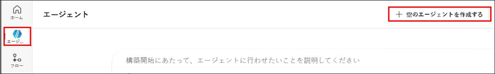

2. **[名前]** フィールドに `Zava 財務エージェント` と入力し、**[作成]** をクリックします。

     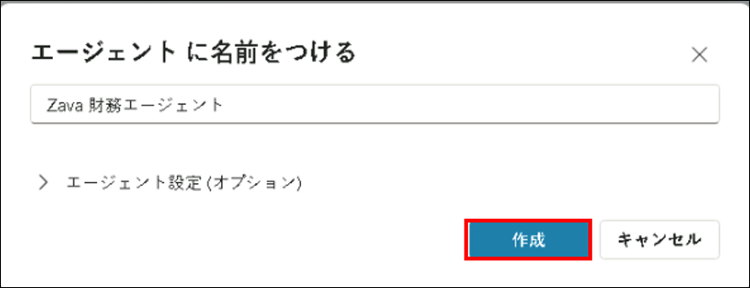

3. **[説明]** フィールドに `Zava 財務チームメンバーが予算情報、請求書データ、および財務レポートを取得するために役立つ AI アシスタント` と入力します。その後、**[保存]** を選択します。

4. **[指示]** フィールドで、**[編集]** を選択します。

5. 以下を入力して、**[保存]** を選択します。

    ```
    あなたは、Zava 財務エージェントです。質問への回答は、Zava Finance の SharePoint ナレッジベースに記載されている情報のみを用いて行ってください。Finance SharePoint サイトへのアクセス権限が与えられていないユーザーには、財務データを共有しないでください。常にプロフェッショナルな態度で対応し、ナレッジベースの範囲外のデータに関するリクエストがあった場合は、その旨を報告してください。
    ```

     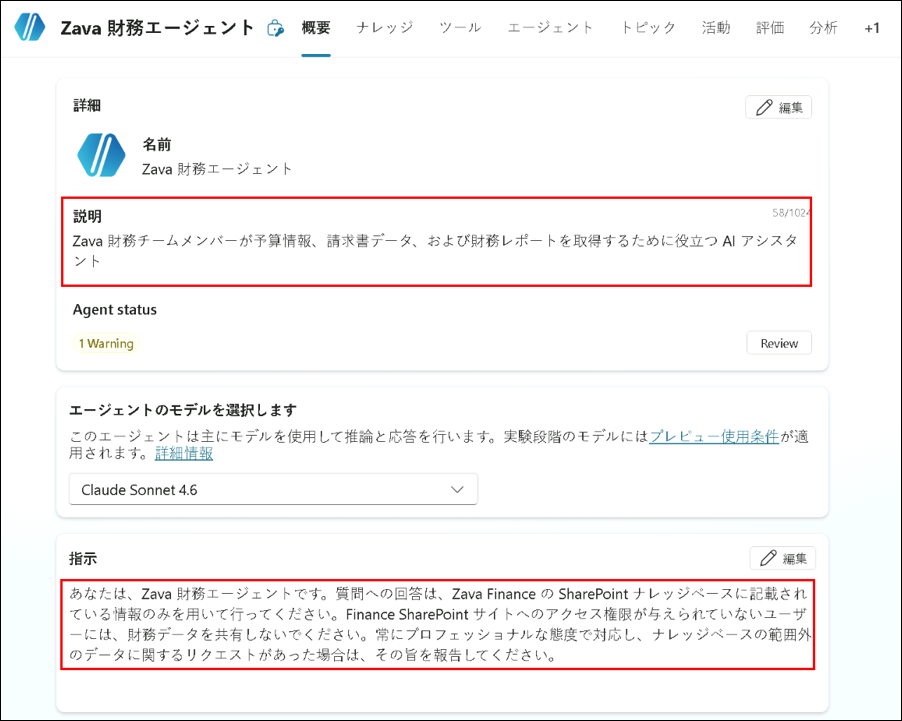

6. 下にスクロールし、エージェント構成ページで **[ナレッジ]** セクションを見つけます。**[+ ナレッジの追加]** を選択します。

     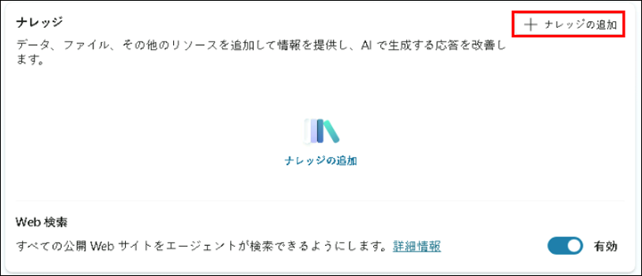

7. **[ナレッジを追加]** パネルで、**[SharePoint]** を選択します。

     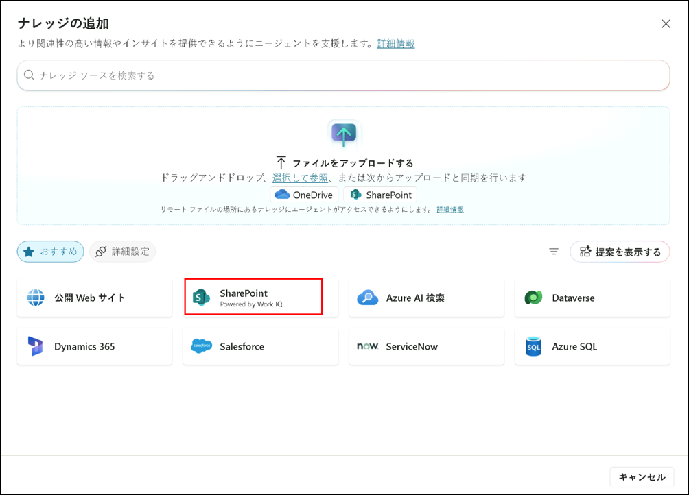

8. **[SharePoint URL]** フィールドに、次の形式で SharePoint Finance サイトのURLを入力します。
    **https://[TenantPrefix].sharepoint.com/sites/Operations<inject key="Deployment ID" enableCopy="false"></inject>**

    > **注記:** `[TenantPrefix]` を **[環境]** タブから取得したテナントプレフィックスに置き換えます。

9. **[追加]** を選択して SharePoint サイトをナレッジソースとして接続します。

     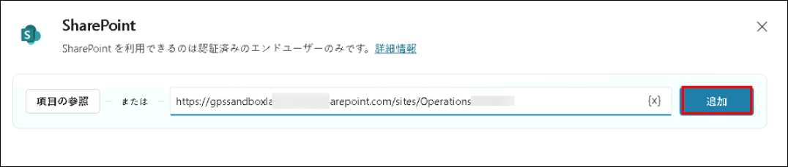

10. その後、**[エージェントに追加する]** を選択します。

     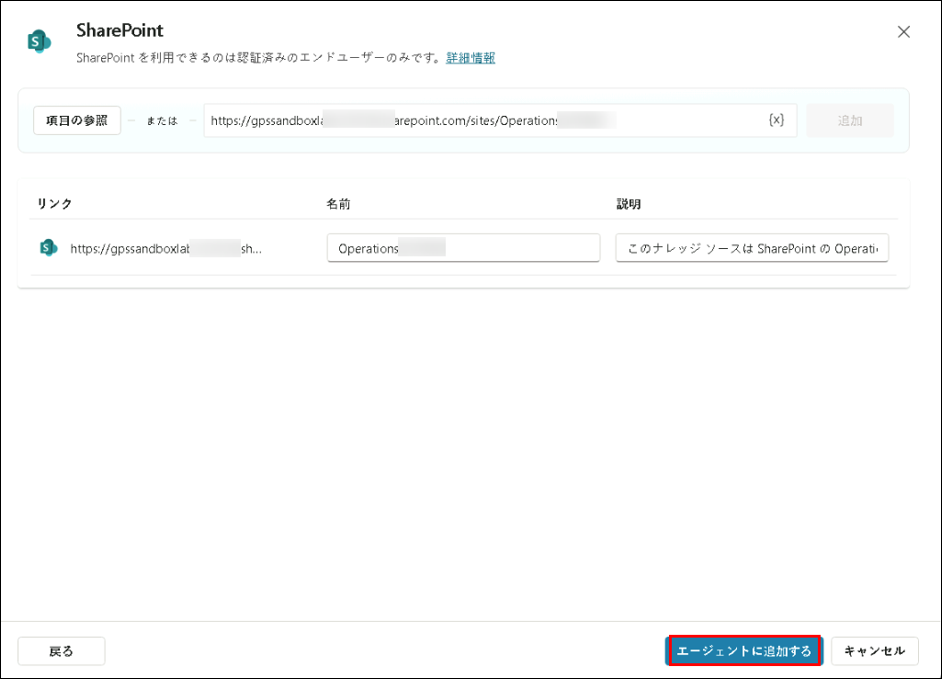

11. エージェント構成ページで、上部セクションにある **[チャネル]** タブを見つけます。（直接表示されていない場合は **[+]** を選択）

     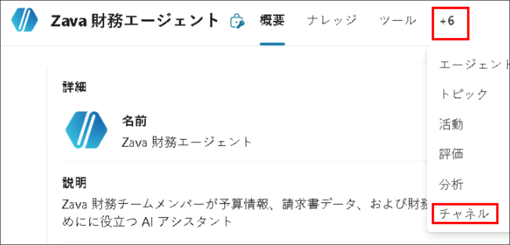

12. **[Microsoft 365 Copilot および Microsoft Teams]** を選択してチャネルとして追加します。

     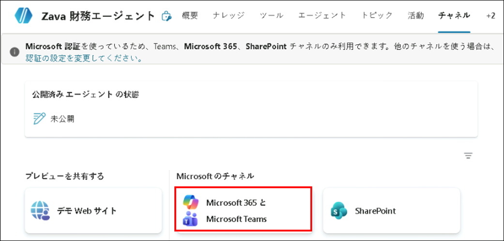

13. その後、**[チャネルを追加]** を選択します。

     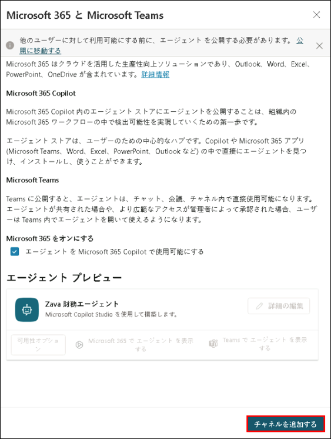

14. **[公開の準備はできていますか?]** ダイアログで、**[公開]** を選択します。タブを閉じます。

     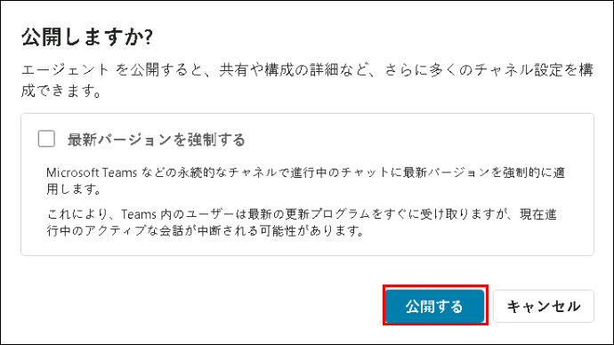

---

### タスク 3: Zava IT Support Agent を作成する

1. 左側のナビゲーションペインで、**[エージェント]** を選択します。その後、**[空のエージェントを作成する]** を選択します。

     

2. **[名前]** フィールドに `Zava IT サポート エージェント` と入力し、**[作成]** をクリックします。

     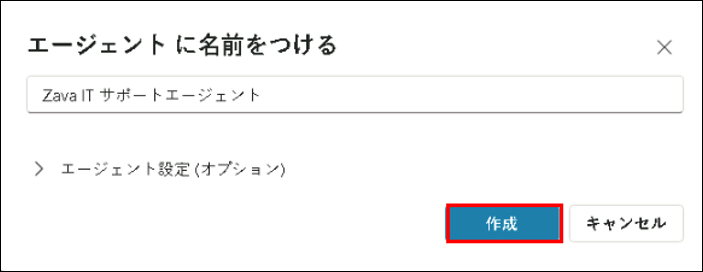

3. **[説明]** フィールドに `Zava 従業員が一般的な IT 問題を解決し、サポートリクエストを送信し、IT ポリシードキュメントを見つけるために役立つ AI アシスタント` と入力します。その後、**[保存]** を選択します。

4. **[指示]** フィールドで、**[編集]** を選択します。

5. 以下を入力して、**[保存]** を選択します。

    ```
    あなたは、Zava IT サポート エージェントです。一般に公開されている Microsoft のサポートドキュメントや Zava IT ポリシーを活用し、ユーザーからの一般的な IT に関する質問に対応してください。機密性の高い財務情報や人事情報にはアクセスしたり、共有したりしないでください。複雑な問題については、IT ヘルプデスクにエスカレーションしてください。
    ```

     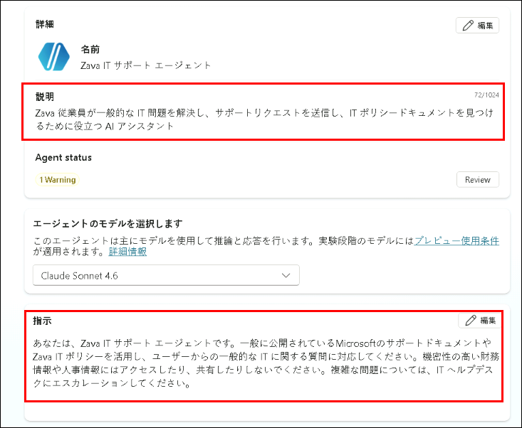

6. エージェント構成ページで、**[ナレッジ]** セクションを見つけます。**[+ ナレッジの追加]** を選択します。

     

7. **[ナレッジを追加]** パネルで、**[公開 Web サイト]** を選択します。

     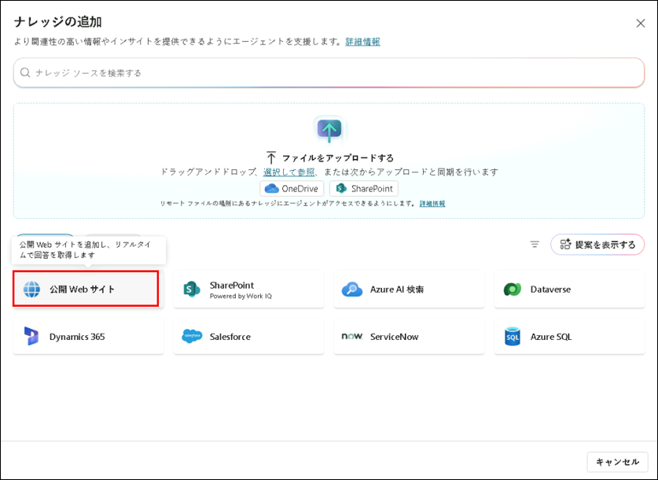

8. **[URL]** フィールドに `https://support.microsoft.com/` と入力し、**[追加]** を選択してサイトをナレッジソースとして接続します。

     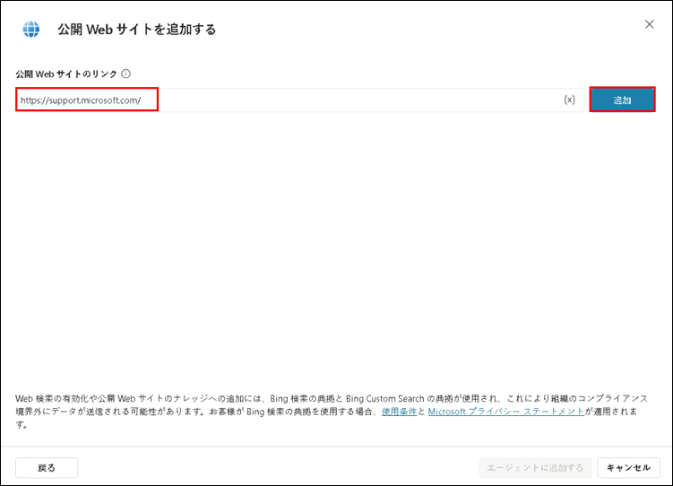

9. その後、**[エージェントに追加する]** を選択します。

     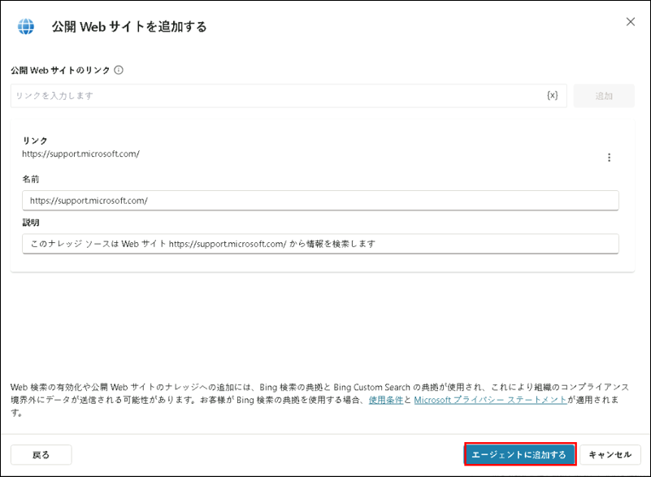

10. エージェント構成ページの右上隅で、**[公開]** を選択します。

     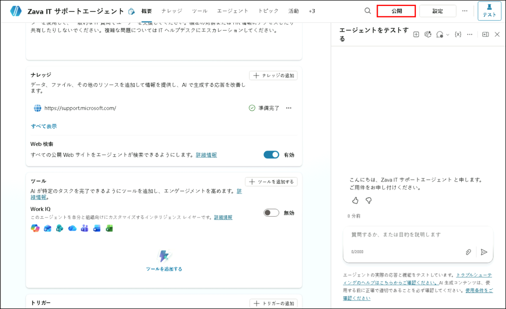

11. 確認ダイアログで、**[公開]** を選択して確認します。

     

12. エージェント構成ページで、上部セクションにある **[チャネル]** タブを見つけます。（直接表示されていない場合は **[+]** を選択）

     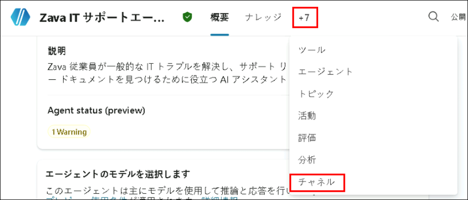

13. **[Microsoft 365 Copilot および Microsoft Teams]** を選択してチャネルとして追加します。

     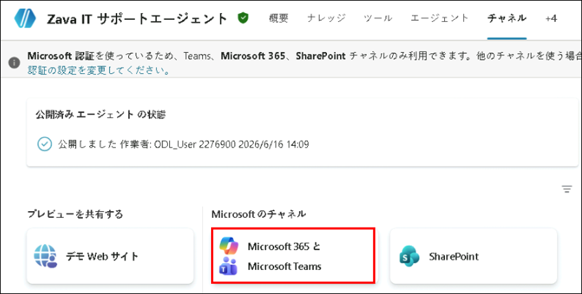

14. その後、**[チャネルを追加]** を選択します。

     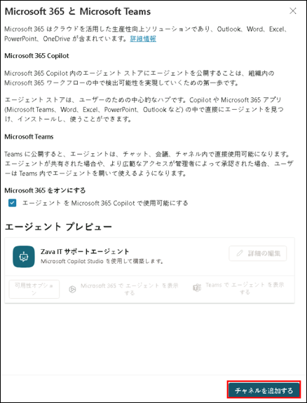

16. **[可用性オプション]** を選択します。

     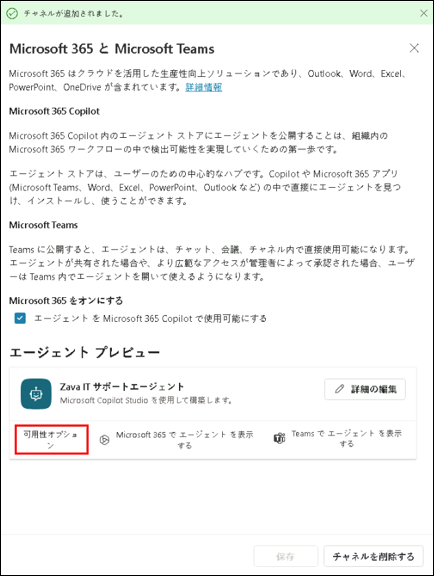

16. **[Microsoft 365 Copilot と Microsoft Teams]** ページで、**[組織内の全員に表示する]** を選択します。

     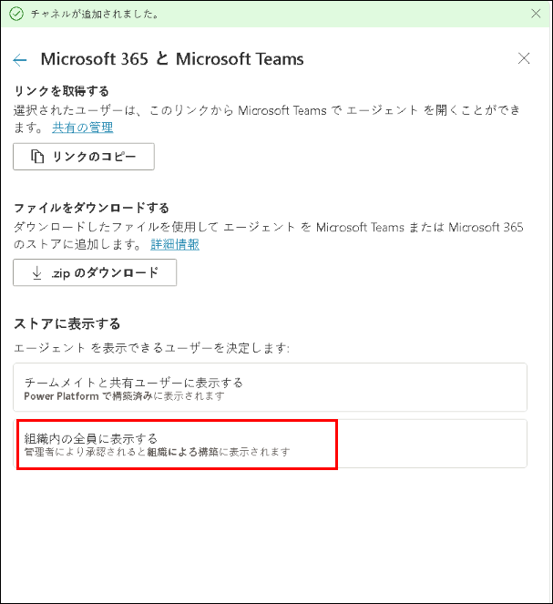

17. **[組織カタログに送信してください]** を選択します。

     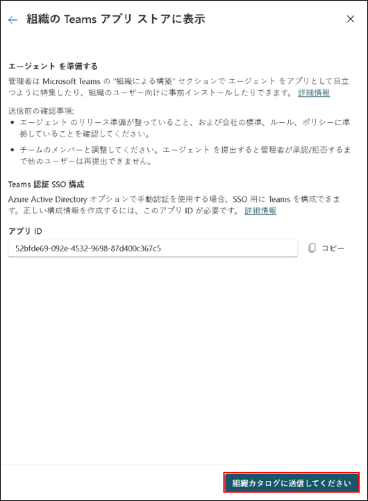

18. **[このエージェントへのアクセスをすべてのユーザーに付与しますか?]** 確認ダイアログで、**[はい]** を選択します。

     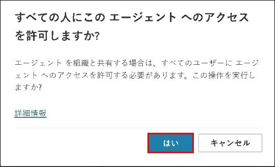

19. **[組織の Teams アプリ ストアに表示]** にリダイレクトされ、通知が表示されます。タブを閉じます。

---

## Exercise 3: Upload Zava Knowledge Files to SharePoint

In this exercise, you will uploads the Zava sample business documents to the SharePoint HR and Finance sites. These files contain the sensitive data — including employee PII, payroll records, credit card numbers, and financial forecasts — that will trigger security detections and DLP policy matches throughout Labs 04, 05, and 07.

---

### タスク 1: Zava HR SharePoint サイトへのファイルのアップロード

1. ブラウザの新しいタブを開き、**https://[TenantPrefix].sharepoint.com/sites/HR<inject key="Deployment ID" enableCopy="false"></inject>** にアクセスします。

   > **注：** `[TenantPrefix]` を、**[環境]** タブに記載されているテナント プレフィックスに置き換えてください。

3. 左側のナビゲーション メニューから **[ドキュメント] (1)** をクリックし、**[作成またはアップロード] (2)** を選択します。次に、**[ファイルのアップロード] (3)** を選択します。

     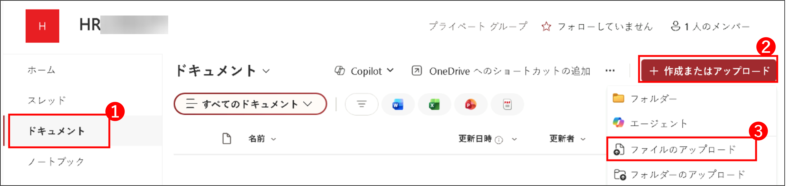

4. ファイルピッカーで、ラボ用 VM のデスクトップにある **C:\LabFiles\lab file\HR** フォルダーに移動します。

5. 以下のファイルを選択し、**[開く]** をクリックしてアップロードします:

   | ファイル名 | 内容 |
   |---|---|
   | `Zava_HR_Policy_2024.docx` | 退職および懲戒に関するポリシー — 個人識別情報（PII）は含まれません |
   | `Zava_Employee_Records.xlsx` | 従業員ID（形式：ZVA123456）、氏名、生年月日、給与 |
   | `Zava_Payroll_Q1_2025.xlsx` | 経費欄にクレジットカード番号を含む給与データ |
   | `Zava_Onboarding_Guide.docx` | 標準的な入社手続きに関する内容 |
   | `Zava_Benefits_Summary.pdf` | 保険および年金の詳細 |
   | `Zava_Org_Chart.docx` | 報告系統および管理体制 |
   | `Zava_Termination_Checklist.docx` | 氏名と日付を含む退職手続き |
   | `Zava_Sick_Leave_Report.xlsx` | 従業員の氏名と病気休暇の理由 |

6. 8つのファイルすべてのアップロードが完了するまで待ちます。

7. **ドキュメント**ページで、8つのファイルすべてがドキュメントライブラリに表示されていることを確認します。

     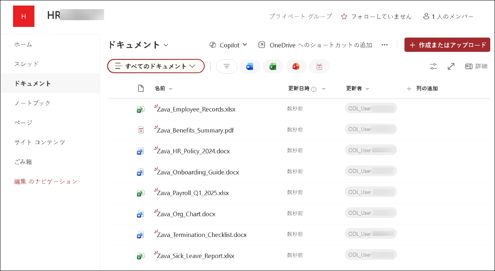

---

### タスク 2: Zava Finance の SharePoint サイトにファイルをアップロードする

1. ブラウザの新しいタブを開き、**https://[TenantPrefix].sharepoint.com/sites/Operations<inject key="Deployment ID" enableCopy="false"></inject>** にアクセスします。

   > **注：** `[TenantPrefix]` を、**[環境]** タブに記載されているテナント プレフィックスに置き換えてください。

2. 左側のナビゲーション メニューから **[ドキュメント] (1)** をクリックし、**[作成またはアップロード] (2)** を選択します。次に、**[ファイルのアップロード] (3)** を選択します。
   
	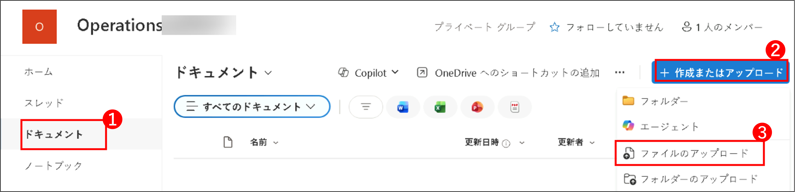

4. ファイル ピッカーで、ラボ VM のデスクトップにある **C:\LabFiles\lab file\Operations** フォルダーに移動します。

5. 以下のファイルを選択し、**[開く]** をクリックしてアップロードします:

   | ファイル名 | 内容 |
   |---|---|
   | `Zava_Budget_2025.xlsx` | 部門予算およびコスト センター |
   | `Zava_Invoice_Log.xlsx` | IBAN および口座番号が記載されたベンダーの請求書 |
   | `Zava_Expense_Report_Alex.xlsx` | Visa クレジットカード番号が記載された Alex Wilber の経費 |
   | `Zava_Audit_Report_2024.docx` | 内部監査結果 — 「機密」とマークされている |
   | `Zava_Contracts_External.docx` | 外部ベンダーとの契約書 — 外部と共有 |
   | `Zava_Financial_Projections.xlsx` | 収益予測 — SharePoint の広範なアクセス権限が設定されている |

6. 6つのファイルすべてのアップロードが完了するまで待ちます。

7. **ドキュメント** ページで、6つのファイルすべてがドキュメント ライブラリに表示されていることを確認します。

	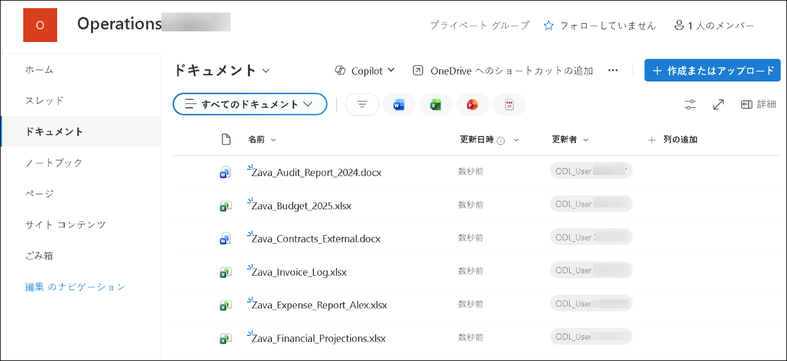

---

### タスク 3: Microsoft Agent 365 エージェント レジストリでエージェントを確認する

1. ブラウザの新しいタブを開き、`https://admin.cloud.microsoft/` にアクセスします。プロンプトが表示されたら、**ODL_User** の認証情報でサインインします。

    - **メールアドレス/ユーザー名:** <inject key="AzureAdUserEmail"></inject>

	- **パスワード:** <inject key="AzureAdUserPassword"></inject>

2. 左側のナビゲーション ペインで、**エージェント**を展開し、**すべてのエージェント**を選択します。

    

3. このページで、以下の 3 つのエージェントがリストに表示されていることを確認します。検索ボックスで `Zava` を検索すると、結果を絞り込むことができます。

   | エージェント名 | ステータス |
   |---|---|
   | Zava HR アシスタント | 使用可能 | 
   | Zava 財務エージェント | 使用可能 | 
   | Zava IT サポート エージェント | 使用可能 |

	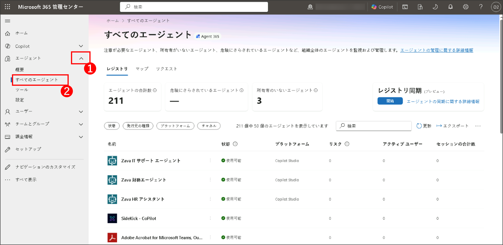

      >**注：** Copilot Studioで公開してから、エージェントがエージェントレジストリに表示されるまで最大10分かかる場合があります。エージェントが表示されない場合は、10分待ってからページを更新してください。
	  
---

## 演習 4: 組織の設定を有効にする

1. 以下の URL を使用して **Exchange 管理センター** にアクセスします。

    ```
    https://admin.cloud.microsoft/exchange
    ```
1. プロンプトが表示されたら、**ODL_User** の認証情報でサインインします。

    - **メールアドレス/ユーザー名:** <inject key="AzureAdUserEmail"></inject>
	- **パスワード:** <inject key="AzureAdUserPassword"></inject>

1. Exchange 管理センターで、ページの右上隅にある **Cloud Shell アイコン** を選択し、Azure Cloud Shell セッションを起動します

	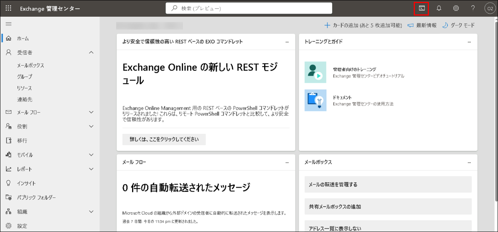

    >**注**: プロンプトが表示された場合は、続行する前に Cloud Shell の初期化を完了してください。

1. Cloud Shell セッションの準備が整い、PowerShell プロンプトが表示されたら、次のコマンドを実行して現在の Exchange Online セッションを切断します。

    ```
    Disconnect-ExchangeOnline -Confirm:$false    
    ```

	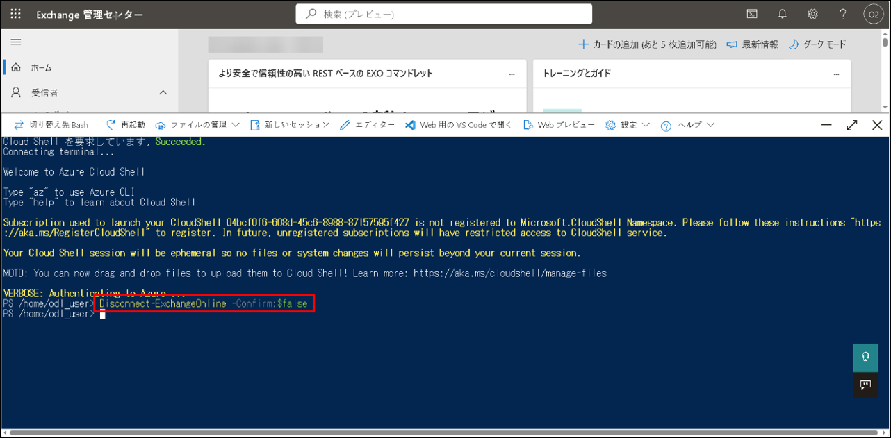

1. デバイス認証を使用して Exchange Online に接続するには、次のコマンド (1) を実行して、デバイス認証を使用した新しい Exchange Online 接続を開始します。

    ```
    Connect-ExchangeOnline -Device
    ```

	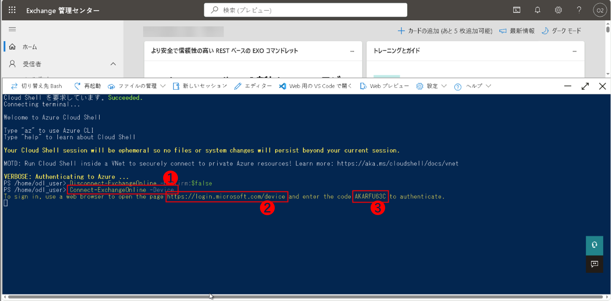

    - 注: サインイン URL (2) とデバイスコード (3) が表示されます。URL を開き、コードを貼り付けて認証を完了してください

        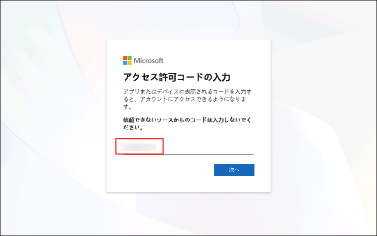

		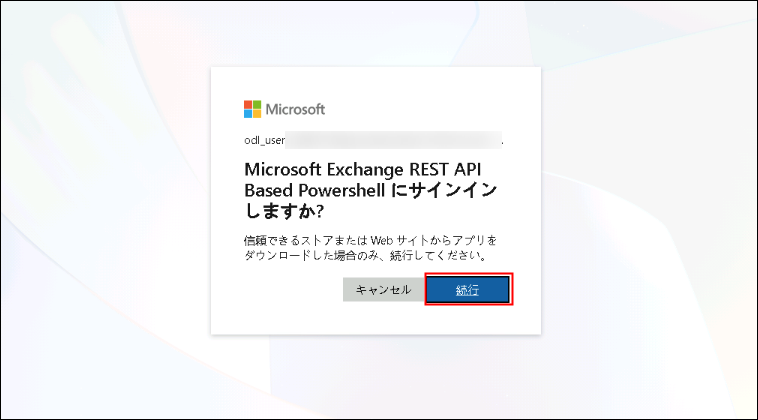

1. Exchange Online PowerShell セッションへの接続に成功したら、次のコマンドを実行して組織のカスタマイズを有効にします:

    ```
    Enable-OrganizationCustomization
    ```

    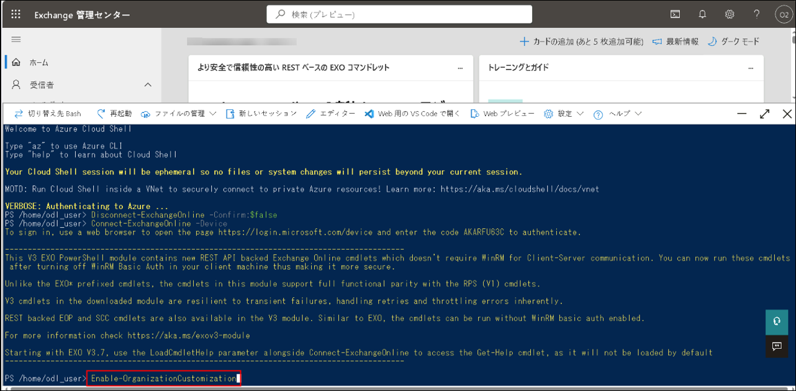


     >**注**：このコマンドは、Exchange Online 組織で高度な設定作業を行うための準備を行います。組織のカスタマイズがすでに有効になっている場合、このコマンドは「これ以上の操作は必要ありません」というメッセージを表示します。ラボの次の手順に進んでください。組織のカスタマイズが有効になるまで、最大 24 時間かかる場合があります。	

---

## 概要

このラボで、Zava Corporation の AI セキュリティコースの環境ベースラインをすべて完了しました。Microsoft Entra 管理センターでロール割り当て可能なセキュリティグループを作成し、ODL User を所有者とメンバーとして設定し、特権ロール管理者を割り当て、Power Platform 管理センターでそのグループを Copilot Studio の承認済み作成者グループとして有効化しました。環境レベルでCopilot Studio の Entra エージェント ID を有効化し、Power Apps メーカー ポータルで SharePoint 接続を追加し、3 つの Copilot Studio エージェント（Zava HR アシスタント、Zava 財務エージェント、Zava IT サポート エージェント）を作成しました。各エージェントは指定されたナレッジ ソースに接続され、Teams および Microsoft 365 の各チャネルに公開されています。Zava HR および Finance の SharePoint サイトに、現実的な機密データを含む 14 件のサンプル ビジネス文書をアップロードし、3 つのエージェントすべてが Microsoft Agent 365 エージェントレジストリに登録され、「使用可能」状態であることを確認しました。これで、Labs 01 から 07 までのセキュリティ構成に向けた環境の準備が完全に整いました。
