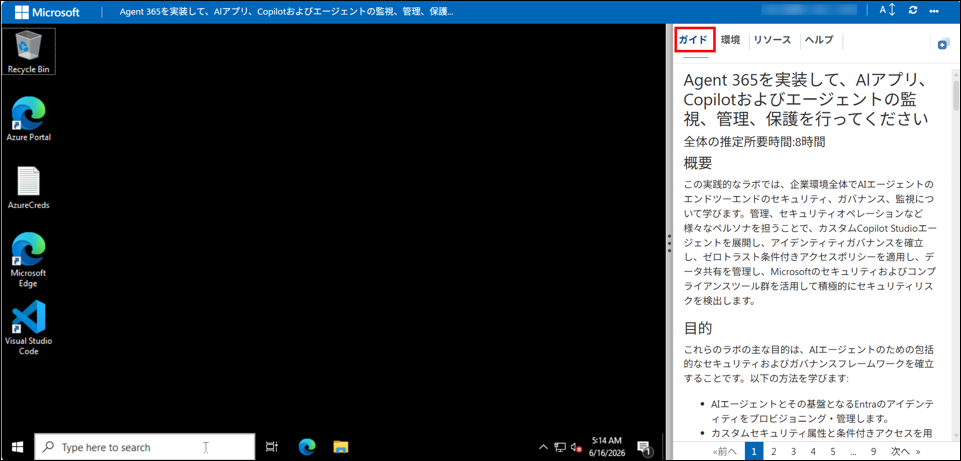
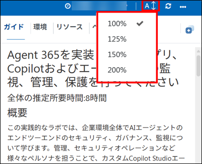
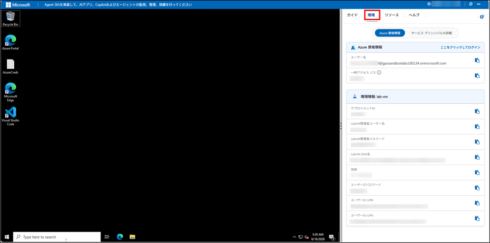
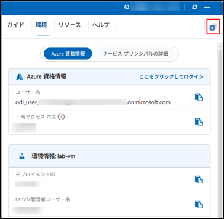
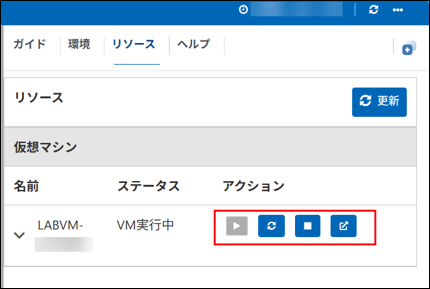
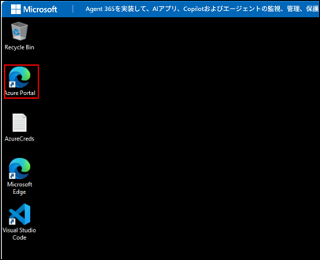
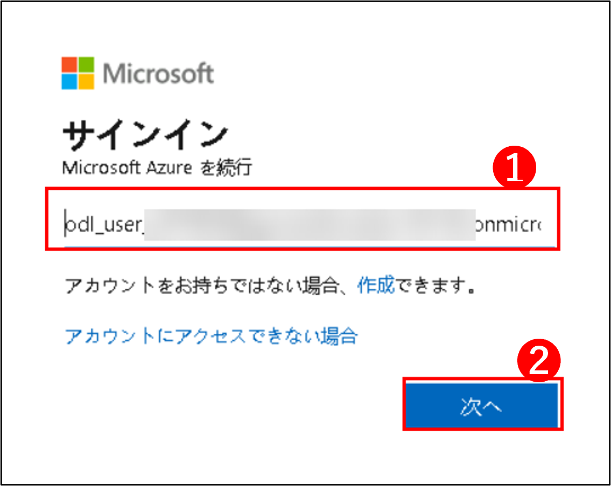
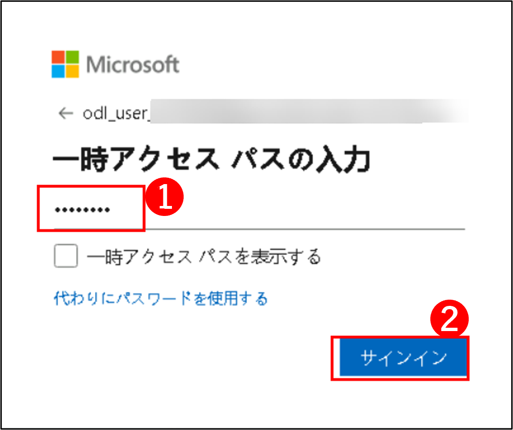
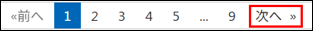

# Agent 365 を実装して、AI アプリ、Copilot、エージェントを観察、管理、保護する

### 全体推定所要時間: 8 時間

## 概要

このハンズオンラボでは、企業環境全体の AI エージェントのエンド ツー エンドセキュリティ、ガバナンス、監視について学習します。管理者、セキュリティオペレーション、その他のペルソナを担当することで、カスタム Copilot Studio エージェントをデプロイし、ID ガバナンスを確立し、ゼロトラスト条件付きアクセスポリシーを適用し、データ共有を管理し、Microsoft のセキュリティおよびコンプライアンスツールスイートを使用してセキュリティリスクを積極的に検出します。

## 目的

これらのラボの主な目的は、AI エージェント用の包括的なセキュリティおよびガバナンスフレームワークを確立することです。以下の方法を学習します:
- AI エージェントとその基盤となる Entra ID を プロビジョニングおよび管理する。
- カスタムセキュリティ属性と条件付きアクセスを使用して、ゼロトラスト制御を AI エージェントに拡張する。
- Microsoft Purview 機密ラベルと データ損失防止 (DLP) ポリシーを使用して、機密企業データを AI のオーバーシェアリングから保護する。
- Microsoft Defender XDR と高度な検出を使用して、設定誤りまたはリスクのあるエージェントを表示および調査する。
- データセキュリティ態勢の管理 (DSPM) を使用してデータリスクを評価し、オーバーシェアリングを修復する。
- 監査ログ、保持ポリシーを管理し、Security Copilot を使用してイベントを分析することにより、コンプライアンス義務を履行する。

## 前提条件

- Microsoft Copilot Studio、Microsoft Entra ID、Microsoft Purview、および Microsoft Defender XDR 用の適切なライセンスおよび管理アクセス権を備えた Microsoft 365 テナント。
- 指定されたラボペルソナへのアクセス: **ODL ユーザー** (セットアップ/管理)、**Patti Fernandes** (SOC アナリスト/セキュリティ管理者)、および **Adele Vance** (エンドユーザー)。
- **ラボ 00 を最初に完了する必要があります**。基本環境をセットアップするためです。必要な SharePoint サイト (HR および運営)、Entra ID セキュリティグループ (`copilotagentsecurity`)、および 3 つの主要な Zava Copilot Studio エージェント (HR アシスタント、財務エージェント、IT サポート エージェント) を作成します。これらはすべての後続ラボのガバナンス対象として機能します。

## コンポーネントの説明

- **Microsoft Copilot Studio:** カスタム AI エージェントの作成、管理、デプロイに使用します。
- **Microsoft Entra ID:** ID、グループメンバーシップを管理し、AI エージェント用の条件付きアクセスポリシーを通じてゼロトラストを実行します。
- **Microsoft Purview:** Data Loss Prevention (DLP) ポリシーと機密ラベルを提供して、データ共有を管理し、過剰な露出を防ぎます。
- **Microsoft Defender XDR および Defender for Cloud Apps:** 高度な検出および認証されていないか設定誤りのあるエージェントの検出に使用されます。
- **Microsoft Security Copilot:** 監査イベント、ログ、インタラクションデータを分析してコンプライアンス義務を履行するのに役立ちます。
- **Microsoft 365 管理センター (エージェントレジストリ):** テナント全体のカスタム AI エージェントの検出、検査、ライフサイクル管理に使用されます。

## ラボの開始方法

Capstone Project Workshop へようこそ。このエクスペリエンスを最大限に活用しましょう:

## ラボ環境へのアクセス

準備ができたら、仮想マシンと **ガイド** がウェブブラウザ内で利用可能になります。

## ラボガイドのズーン イン/ズーム アウト

環境ページのズームレベルを調整するには、ラボ環境のタイマーの横にある **A↕ : 100%** アイコンをクリックします。

## 仮想マシンとラボガイド

仮想マシンはワークショップ全体を通じてのメイン作業ツールです。ラボガイドはあなたの成功へのロードマップです。

## ラボリソースの確認

ラボリソースと認証情報をよく理解するために、**環境** タブにナビゲートします。

## スプリットウィンドウ機能の使用

便宜上、右上隅の **分割ウィンドウ** ボタンを選択して、ラボガイドを別のウィンドウで開くことができます。

## 仮想マシンの管理

**リソース (1)** タブから、必要に応じて仮想マシンを **開始、停止、または再起動 (2)** してください。あなたの体験はあなたの手中にあります!

## Azure ポータルで始めましょう

1. 仮想マシン上で、Azure ポータルアイコンをクリックします。

    

2. **Microsoft Azure へのサインイン** タブが表示されます。ここで認証情報を入力します:

   - **メール/ユーザー名:** <inject key="AzureAdUserEmail"></inject>

     

3. 次に、パスワードを入力します:

   - **パスワード:** <inject key="AzureAdUserPassword"></inject>

     

4. **操作が必要です** というポップアップウィンドウが表示される場合は、**後で聞く** をクリックします。
5. **サインインしたままにしますか** と表示された場合は、**いいえ** をクリックできます。
6. **Microsoft Azure へようこそ** というポップアップウィンドウが表示される場合は、単純に **キャンセル** をクリックしてツアーをスキップしてください。

## 「後で聞く」オプションが表示されない場合の MFA セットアップ手順

1. **「詳細情報が必要です」** というプロンプトで、**次へ** を選択します。

1. **「アカウントのセキュリティを保つ」** ページで、**次へ** を 2 回選択します。

1. **注:** モバイルデバイスに Microsoft Authenticator アプリをインストールしていない場合:

   - **Google Play ストア** (Android) または **App Store** (iOS) を開きます。
   - **Microsoft Authenticator** を検索して、**インストール** をタップします。
   - **Microsoft Authenticator** アプリを開き、**アカウントを追加** を選択してから、**職場または学校のアカウント** を選択します。

1. **QR コード** がコンピュータースクリーンに表示されます。

1. Authenticator アプリで、**QR コードをスキャン** を選択し、画面に表示されたコードをスキャンします。

1. スキャン後、**次へ** をクリックして続行します。

1. 電話で、コンピュータースクリーンに表示されている番号を Authenticator アプリに入力し、**次へ** を選択します。
1. サインインしたままにするよう求められた場合は、「いいえ」をクリックできます。

1. **Microsoft Azure へようこそ** というポップアップウィンドウが表示される場合は、単純に「後で」をクリックしてツアーをスキップしてください。

## サポート連絡先

CloudLabs サポートチームは、年中無休 24 時間 365 日、メールとライブチャットを通じて利用可能で、いつでもシームレスなサポートを提供します。学習者とインストラクター向けに特別に調整された専用サポートチャネルを提供し、すべてのニーズが迅速かつ効率的に対応されることを保証します。

学習者向けサポート連絡先:

- メールサポート: [cloudlabs-support@spektrasystems.com](mailto:cloudlabs-support@spektrasystems.com)
- ライブチャットサポート: https://cloudlabs.ai/labs-support

右下隅から **次へ** をクリックして、ラボジャーニーを開始してください!

これで、テクノロジーの強力な世界を探索する準備が整いました。ご質問があればお気軽にお問い合わせください。ワークショップをお楽しみください!
